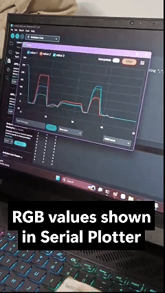

# 🌈 TCS3200 Color Recognition System (Arduino-based)

This project implements a real-time color identification and classification system using the **TCS3200** sensor and an **I2C 16x2 LCD** for data visualization.



## 🚀 Key Features

* **RGB Processing:** Converts raw frequency data from the sensor into the standard RGB color space (0-255).
* **Auto-Scaling:** Configures the output frequency scaling to **20%** (S0-HIGH, S1-LOW) to optimize sensing accuracy for 8-bit microcontrollers.
* **Smart Classification:** Advanced logic algorithms to accurately distinguish primary colors: Red, Green, Blue, White, Black, and Yellow.
* **I2C Integration:** Minimizes wiring by using the I2C protocol for the display interface.

## 🛠️ Components

* **MCU:** Arduino Uno / Nano.
* **Sensor:** TCS3200 (Color Sensor).
* **Display:** 16x2 LCD with I2C Module (PCF8574).

## 📌 Pinout & Connections

| TCS3200 | Arduino | Function |
| :--- | :--- | :--- |
| **S0, S1** | D4, D5 | Output Frequency Scaling |
| **S2, S3** | D6, D7 | Photodiode Type Selection (Filter) |
| **Out** | D8 | Frequency Output Reading |
| **SDA, SCL** | A4, A5 | I2C Communication for LCD |

## ⚙️ Core Algorithm

The system operates by sequentially scanning color filters via the **S2 & S3** control pins, then using the `pulseIn()` function to measure the output pulse duration. The raw data is normalized using a **Mapping** function based on **Calibration** values to ensure maximum accuracy under consistent lighting conditions.

## Video Demo
<video src="demo/tcs3200-low.mp4" controls="controls" style="max-width: 100%;">
  Your browser does not support the video tag.
</video>

### Code Snippet: Red Filter Logic
```cpp
// Logic for selecting the Red filter
digitalWrite(S2, LOW);
digitalWrite(S3, LOW);

// Reading the frequency
redFrequency = pulseIn(sensorOut, LOW);

// Mapping to RGB space (0-255)
redColor = map(redFrequency, R_MIN, R_MAX, 255, 0);
